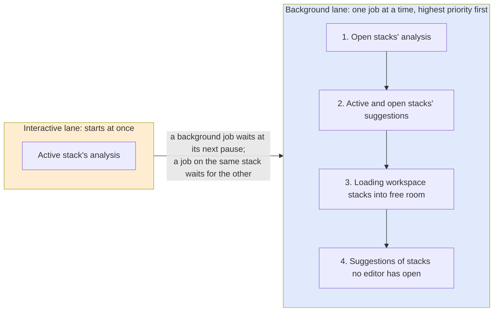
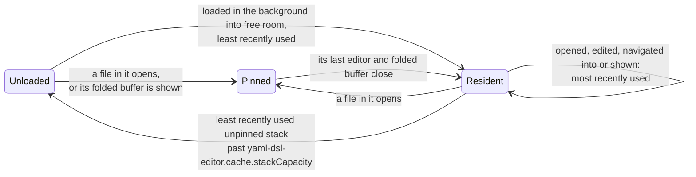
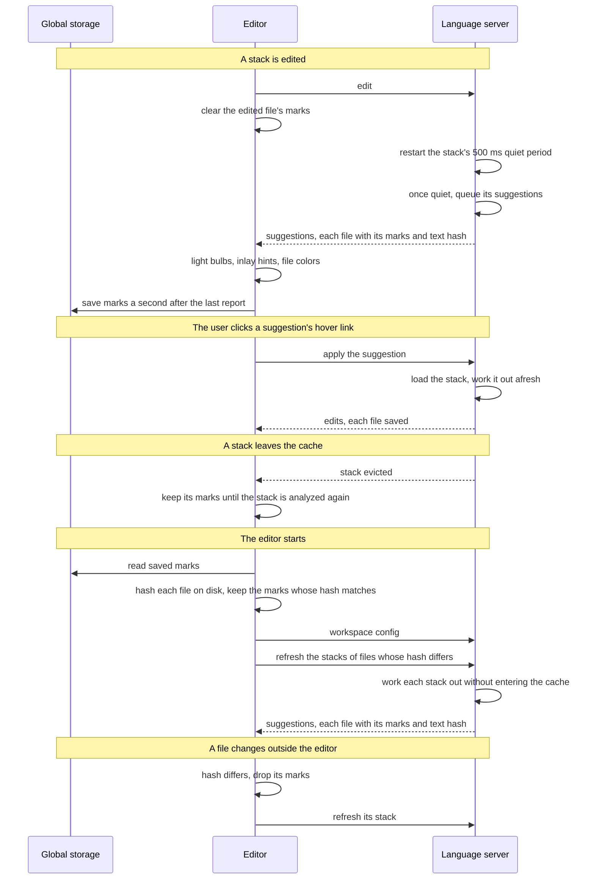

# YAML DSL editor

Authoring `sample.yml` is hard without this extension, and that is why it exists. A stack is a common layer and its overlays. The file on screen is one of those, not an overlay's full config. A field's documentation sits beside a `$ref` the usual YAML tooling never reads. A `ref` and a `local` are strings, so nothing jumps to the declaration. The extension is the editor that makes that document authorable.

The extension is generic. Any DSL written this way is a block in the workspace config, `yaml-dsl.yml`. Nothing about a particular DSL is compiled into the extension, and the config states every rule: the extension has no defaults, because every DSL is different. The block says which files belong, the DSL's scopes, where names are declared and how they are referenced, its placeholders and functions, when the DSL has layers which directories are overlays, and a fallback schema for a document that does not name one. Scopes, references, placeholders and calls are generic: the editor validates, navigates, completes and hovers them the same way in every DSL. Each DSL's block supplies the syntax, and those syntaxes differ.

`sample.yml` is the DSL this document works through. Its field types are shared definitions, because a value may be a scalar, a `ref`, or a bare `local`. A simpler DSL uses the same engine through its own config block. The first config block, and the first files the editor is proven against, are `sample.yml`.

Features are fine-tuned iteratively. The first slice is what any editor for a programming language provides: hover documentation, and navigation of refs and locals. Diffing overlays, suggestions, and extraction into the common layer come after that slice and are tuned the same way.

## Language server

The editor is a language server. It has to be. Activating any `sample.yml` puts the whole stack in scope: the common layer and every adjacent overlay. The server holds that context. Switching from one file in the stack to another uses it. Rebuilding the stack on each switch would be slow.

The server keeps the stack current as the files change, including the folded document of each overlay. Those folded documents are buffers in the editor view, so the author sees an overlay's full config instead of assembling it from the files. Hover and navigation run against the stack in scope, not against the active file alone.

On each change the server parses the changed YAML, reads that file's schema, and resolves references, placeholders and calls across the stack. Hover and navigation are requests against that analysis. Problems and later suggestions are further results of the same pass. A problem has a severity. An error is red text with a red squiggle at its range, in the red the DevOps tools print failures in, and its line carries an error mark in the gutter. An info problem, a schema the file names that cannot be loaded, is a wavy underline in the blue the DevOps tools print info in, with no change to the text, and its line carries an info mark in the gutter, the same shape and size as the error mark. Either shows its message on hover, and an empty range covers its whole line.

The workspace holds many stacks. The server loads one when a file in it becomes active, and does not load the rest at startup. A resident stack is the parsed common layer, every adjacent overlay, the symbol index, and the folded document of each overlay. Switching files inside a resident stack is a hit.

The file in the active editor is worked on right away, ahead of all other files. Work on its stack goes first, the stacks of other open files next, then the suggestions of the active and open stacks, and only then anything in the background: loading the rest of the workspace and the suggestions of stacks no editor has open. Open editors always come before background work. Work on the active file starts at once: a background job in progress waits at its next pause and resumes after it, and only work on the same stack waits for the job holding it. A request about a file is answered once that file's analysis is done.



The cache is bounded, and the unit is the stack. Every stack with a file in an open editor is pinned, and so is any stack whose folded buffer is on screen. A pin is never evicted. Opening, editing, navigating into, or showing a stack marks it most recently used. Background work is not use: loading the workspace's files in the background fills only free room and evicts nothing, a stack loaded that way is the first to go, and rebuilding stacks after a config change keeps their places. Capacity beyond the pins is the setting `yaml-dsl-editor.cache.stackCapacity`. Loading one past that, or lowering the setting, evicts the least recently used unpinned stack: its analysis is dropped and its folded buffers close. The files on disk stay. The next activation loads that stack again. A change to a resident stack updates it in place.



A stack's schema is the `schema.json` of the grammar version that stack initialized. The same grammar version is the same schema, so every stack on that version shares one parsed copy. A different grammar version is a different schema, even when the difference is small, and hover for a stack uses the schema of its own version. The schema cache is bounded too, and its unit is the distinct schema, one entry per hash. A schema a resident stack uses is pinned. Capacity beyond the pins is the setting `yaml-dsl-editor.cache.schemaCapacity`, and past it the least recently used schema is dropped. Evicting a stack unpins the schemas only it used. What the extension works out from a schema, such as the node fingerprints and validators of the schema checks, belongs to that schema's entry and goes with it.

A schema on disk changes when its stack is initialized again. The server watches every path a resident file's schema search reads, and any change at one of them reloads that file's schema. It also watches every layer file of a resident stack: a layer file that changes on disk while no editor has it open is read again, and one deleted leaves the stack.

Every input takes effect without reloading the window. A `yaml-dsl.yml` saved, created or deleted, and a workspace folder added or removed, reload the configs: every resident stack is analyzed again under them, and a stack they no longer claim is dropped. A change to an extension setting applies at once. Schemas and layer files are watched as above. Terraform's function metadata is read once per session. Bytes identical to a schema the server holds are that schema and are not parsed again.

The server does not run the engine. The continuous compile is the editor's analysis. Plan and admission stay with the engine.

The extension process is the client. The analysis is a plain module with no editor API in it, so it is tested on its own with `node --test`. Editor features stay in the language server from the start.

Line coverage and branch coverage of the extension's own code are each at least 90%. The `node --test` run measures both and fails if either is under that. Test files are not part of the measured set.

## Common layer and overlays

The core of a layered DSL is how a stack is composed. One `sample.yml` is the common layer. Each overlay is a `sample.yml` under a directory named in `layers.overlay_folders`, `one` or `two`, directly below the common layer's directory. `layers.common_layer_discovery` states how far below: `parent`, the overlay directory holds the file itself, `mock-stack/one/sample.yml`; `ancestor`, the file may sit deeper, at the same path below the overlay directory in every overlay, so `mock-stack/one/config/sample.yml` takes `mock-stack/sample.yml`, the nearest ancestor above an overlay directory. A file below no overlay directory is a common layer. The engine deep-merges the common layer under the overlay, and the folded document is what a plan sees. The same shape without an instance directory (`mock-family/sample.yml` beside `mock-family/one/`) is the same composition.

```
mock-stack/sample.yml
mock-stack/one/sample.yml
mock-stack/two/sample.yml
mock-stack/three/sample.yml
mock-stack/four/sample.yml
```

An author editing one of those files sees only that file. The language server buffers the stack in the editor view: each overlay's folded document, common layer merged with that overlay. Shared config lives in the common layer, including a local that a resource references. The `layers` block in the config is this composition.

While any file in the stack is active, refs and locals resolve in that file's fold. Across overlays, the editor diffs the folded documents. A block repeated in every overlay is one edit away from drifting: the next change lands in a single overlay and the others keep the old copy. The editor suggests moving that block into the common layer, and one click applies it.

## Formatting

Claimed files have a document formatter. It changes indentation and whitespace. Comments, key order, and the spelling of scalars stay, so a format pass does not rewrite a `ref`, a `local`, or a `${...}` placeholder into a different string.

## Paths

Every path in the config is a JSONPath query (RFC 9535) in the subset `$`, `.name`, `.*`, `[*]` and a final `..*`. `$` is the document root, the map that holds the top-level keys. `.*` and `[*]` select every child of a map or a list. `..*` selects every node below the path before it, not that node itself, so a node and everything below it are two entries, `P` and `P..*`. An entry's `skip_keys` lists keys a `.*`, `[*]` or `..*` step does not select or descend into. In a list of path entries, the path names the entry and appears once.

## Scopes

A DSL is a language, and its names live in scopes. A scope's `regions` lists where its names may be referenced: each path's region is the subtree under every node it selects, in any file of the fold, `$` being all of it. `later_items_of_declaring_list` also makes a name visible in the later items of the list that declares it, at any depth inside them. `named_by_parent_key` makes the mapping key enclosing a declaration the scope its name is in. A scope named in capitals is logical: the config lists its `builtin_names`, and the word never appears in a document. Any other scope is literal: its name is the DSL's own word, and the document declares its names. Builtins valid only in some regions are a logical scope of their own, apart from the true globals. Every scope a rule names is declared under `scopes`.

A declaration rule says where names are declared: each node its `path` selects is a declaration. `skip_keys` lists keys a step does not descend into, and `exclude_candidates` lists keys at the last step that are not declarations. `name_source` reads the name from the `key`, from the scalar `value`, or from the `meta_argument` named by `meta_argument_name` of a key such as `http(id=config)`, one name per listed id. `declares_every_name` declares every name of the scope at that key: a scope whose names are defined in a document the editor does not read, such as one whose path holds a placeholder, resolves each name to the key that names the document. A key name takes the `key_token` `all_words`, `first_word` or `last_word`, and `null` for a name not read from the key, in the `name_spelling` `as_written` or `dashes_as_underscores`. `scope_name` is the scope declared under `scopes`.

A reference rule says how names are used. `pattern` is a regular expression with named groups. `positions` lists where a reference may stand: `whole_scalar`, the scalar; `whole_placeholder`, a placeholder that is the whole scalar; `placeholder_in_text`, a placeholder inside longer text; `anywhere_in_scalar`, each match inside a scalar. `text_after_name_allowed` says whether text such as a field path may follow the name. `scope_name` is the scope it resolves in. `scope_group` is the pattern group holding the scope of a `named_by_parent_key` scope, and `null` otherwise. `name_group` is the group holding the name.

A reference resolves to a builtin of its target scope whose region holds the reference, else to a symbol of that scope, with that name, visible from the reference. When several rules read the same text, each is tried in order, and the first that resolves is the reading. A name that holds a local placeholder is also known by the local's value, spelled by its declaration rule: a key `name ${local.thing}` whose local is `mock-thing` is the name `mock_thing`. An overlay's own declaration wins over the common layer's, as it does in the merge, and an overlay sees no other overlay's declarations. The common layer sees its own declarations and a name declared in every overlay that has a file, which opens in the first such overlay `layers.overlay_folders` lists.

## Locals

A local is a named value. `locals.scope_name` names the scope whose declarations are the DSL's locals. That scope is declared under `scopes` like any other, a declaration rule reads its names from keys, and a reference rule reads them. A DSL without the `locals` block has no locals.

A local's value is its declaration's value as written, with every local it references replaced by that local's value, resolved recursively in the file's fold. An overlay's local wins over the common layer's. Each fold resolves each local once, and an edit resolves the edited file's folds again. A local that reaches itself through its references is a problem on its declaration, and its value stays as written. A reference to anything other than a local stays as written inside the value.

Hover on a local shows its value. A key holding a local placeholder is also known by the local's value. Moving a block into the common layer writes each difference as a local.

## Navigating references

Go to definition on a reference opens the declaration it names. Hover shows a local's value, a scalar declaration's value as authored, and any other declaration's scope, name and file with its section. A builtin has no declaration. A reference nothing visible declares is an error, and its hover reads `Invalid reference: <scope>.<name>`. When nothing visible matches, go to definition does not move. Command-click opens the declaration. Resting on a reference shows its declaration after a second, in this language, and moving the pointer away first cancels it. The references peek is not opened.

In `sample.yml` a ref is a whole scalar `ref <type>.<name>`, with an optional field path after the name. Its scope is `<type>`, the mapping key enclosing the resource. A local is a key under `locals`, referenced as a whole scalar `local.<name>` or as `${local.<name>}` inside a scalar. A value shared by resources is a local in the common layer.

The analysis classifies every reference: local when it resolves in the same file, external when it resolves in another file of the stack, error when nothing visible matches. The editor underlines each reference from the text as soon as the file opens, using the config's reference rules, and redraws it by its class once the analysis answers: a local reference keeps a straight underline and an external one is a squiggle, both in the text's own colors. An error turns red, text and squiggle, and its line carries an error mark in the gutter. The whole reference takes its class's underline, placeholders inside it included.

The editor colors references, placeholders and calls from the config: a reference rule's leading literal, its target groups and its other literal text, a placeholder's delimiters and builtin body, and a call's marker, function and splat. The grammar colors plain YAML only, as the HCL editor colors HCL: keys are identifiers, strings are strings, and numbers and `true` / `false` / `null` are constants. A matching file takes the extension's file icon. The extension takes the whole of a file's coloring, so the editor's bracket pair colorization does not apply: a bracket keeps the color of the text it stands in. A `#` starts a comment only at the start of a line or after whitespace.

## Completion

Typing the start of a reference opens the list of what it can name. Each config reference rule is a literal with named groups, and the editor turns it into a template: `^ref (?<type>…)\.(?<name>…)` writes `ref <type>.<name>`. A symbol fills the template, and the result is kept only when the rule's own pattern reads it back as that symbol. A rule whose pattern is not a literal with named groups offers nothing.

The list holds what the file's fold sees and what is visible from the cursor. An overlay offers the common layer's symbols and its own. The common layer offers its own symbols and those declared in every overlay. A resource keyed by a local is offered under the local's value, the spelling a ref uses for it. A ref completes up to the resource name, and the field path after it is the author's. Inside a placeholder the list holds every reference a placeholder body may be, builtins included. After a call marker in a key, the list holds the vocabulary, each entry with its signature.

The list opens as the reference starts and narrows on every character, by the editor's fuzzy match against everything typed since the reference began. Each entry names the declaring file and shows the declaration as authored.

## Hover documentation

The Red Hat YAML extension is not used. It resolves a field to the schema node a draft-07 validator sees, and for these DSLs that node is a shared value definition.

A field's value `$ref`s a composite such as `string_or_ref` or `string_list_or_ref`, because the value may be a scalar, a `ref`, or a bare `local`. The field's own documentation is written beside that `$ref`. Draft-07 ignores every keyword beside a `$ref`, so a compliant hover follows the reference and shows the composite's text — "a literal string, a `ref`, or a bare `local`" — and the field text is never read:

```json
"label": {
  "$ref": "#/definitions/string_or_ref",
  "description": "[required] Mock label for the thing (or `ref`)."
}
```

A schema for this kind of value is built this way.

This extension reads the schema document as authored. Hover walks the YAML path through `properties`, then `patternProperties`, then `additionalProperties`. On an object that carries both a `$ref` and a `description`, it keeps that `description`, then follows the `$ref` only to keep walking. The tooltip is the description kept at the field, requirement marker included (`[required]`, `[~required]`, `[optional]`). The composite's description is the value shape and is not the tooltip.

A requirement marker is the extension's standard for saying whether a key must be present. A field's `description` opens with it: `[required]`, the key is present in every folded document; `[~required]`, present under a condition the schema does not state; `[optional]`, the key may be absent. A marker states the field author's intent beside the field itself, so where a field carries one, the marker decides and its parent's `required` array is not read for that key. A field without a marker is required when its parent's `required` array lists it. Every schema check the extension runs reads requiredness this way.

The schema for a file is the one the file names. A `# yaml-language-server: $schema=` modeline is honored. Its path is relative to that file and points at the schema shipped with the grammar version the stack has initialized. An overlay names `.schema/sample.schema.json`. A common layer names that file through the overlay directory that initialized the stack, such as `one/.schema/sample.schema.json`. That is the grammar the stack is actually on.

The config sets `schema_search_paths`, a list, `[]` when empty. It is the fallback, used when the file has no modeline or the path it names is not on disk. Each entry is relative to the file, the same way a modeline path is, and the first one on disk is the schema. A URL in the path is fetched. The search does not override a modeline that resolves. The extension embeds no schema. When neither source resolves, the file's modeline line gets a problem, or its first line when it has no modeline, and field hovers stay empty. Navigation, other problems and suggestions still run.

DSL-level behavior is configured in `yaml-dsl.yml`: which files, the scopes, the syntax of declarations, references, placeholders and calls, how layers are grouped. The concepts are the editor's. The syntax is the DSL's, and each DSL may spell it differently. That syntax does not move into the schema.

The schema is how the editor understands a field and the shape of an object: which keys exist, what value shape a key takes, and the field's own description, including the text beside a `$ref`. It is read as published. If that is not enough to understand a field or a shape, the schema gains an extension point and the grammar publishes it. The extension does not grow a special case for that object. No such point is added before a field or a shape actually requires one.

The schema is not the engine's checks. The editor handles everything about authoring the DSL files, and those checks are a separate pass. A check can require a group of fields only when another field has a certain value, allow a field for only one mode, or allow exactly one of two fields. The published schema has no such table. A field may be filled from the common layer, and the editor is looking at one file, so a `required` array on the resource alone does not say whether the folded document is complete. The common layer merged under the overlay remains. An extension point is not a transcription of these checks.

## Diffing across overlays

The command opens the stack's overlays together. Each entry is that overlay's folded document: the common layer merged with the overlay file by the same deep merge the engine uses. A path whose folded value is the same in every overlay is quiet. A path whose folded value differs is the diff. An overlay with no file is empty on the common layer, not a missing stack.

## Suggestions

The extension suggests an edit where it can see one. A suggestion is a light bulb in the gutter of the line it concerns and an inlay hint at the end of that line, and the file holding it shows its name in the light bulb's color with a light bulb at the end of its row in the Explorer and on its tab; every folder above it up to the workspace root takes the color. Hovering the hint says what the edit does, and the link in its hover applies the edit in one click. The extension edits files only on that click, once per click: the hint itself takes no click, and a suggestion leaves no standing order behind it. An edit the extension offers passes the schema of every file it writes. The extension turns inlay hints on for its own files, whatever the editor's default, and sets the length past which the editor truncates a hint, `editor.inlayHints.maximumLength`, so a suggestion's label reads whole; a user's own setting for the language still wins. The `yaml-dsl-editor.features.suggestions` setting turns suggestions on or off. Extraction into the common layer is one such suggestion.

Suggestions are worked out in the background. Loading a stack starts its quiet period, and each edit to it restarts the period. Once the stack has had no edit for 500 ms, its suggestions are worked out behind the analysis of every open file, and sent apart from problems and underlines. Typing never waits for them. A file's suggestions outlive its stack leaving the cache and a restart of the editor: the editor keeps them in the extension's global storage, in a folder per workspace named by the hash of the workspace file or its lone folder, so uninstalling the extension deletes them with it, keyed by the file, with a hash of the text they were worked out from, and shows them until the stack is analyzed again. A file whose text on disk no longer matches its hash, at startup or when it changes on disk, loses its kept suggestions, and its stack is worked out again in the background without entering the cache. A click on a kept suggestion loads its stack and works it out afresh before writing anything.



## Extracting the common layer

A block that every overlay states for itself will drift. The next edit changes one overlay, and the others keep the old copy. Extraction puts that block in the common layer so the stack has one copy.

A block is a map at a path below the document root, outside the locals. The editor suggests extracting it when:

- more than half the overlays that have a file hold it, and at least two do;
- every overlay that holds it holds the same keys at every depth;
- the common layer holds nothing at its path, and a map at each path above it.

The suggestion is made at the topmost block that qualifies, never at a block inside it.

Values are compared as written: a reference, a local and a placeholder are their text, whatever they resolve to. A leaf is a difference when the overlays that hold the block do not all hold the same value there. A block with differences is suggested only in a DSL with locals, and only when at least one leaf is the same in every overlay that holds it.

One click:

- writes the block into the common layer, copied from the first overlay holding it in `layers.overlay_folders` order, comments, key order and the blank lines around it included, with each difference replaced by a reference to its local;
- declares each difference's local in the common layer with the value most of those overlays hold, and in each overlay holding another value with its own; when no one value is held by the most overlays, each overlay declares its own value and the common layer declares the empty value of their type, `""`, `0` or `false`, so the name resolves in an overlay that opts out; tied values of differing types, or `null`, offer no move;
- deletes the block from each overlay that holds it, and a parent map left empty by that, merging the blank lines around it into one;
- writes `{}` at the block's path into each overlay with a file that does not hold it, so that overlay keeps none of it;
- saves every file it changed.

The click is one undo step across those files. An undo or redo that brings one of them back to its text before or after a click saves it, so undoing a move leaves no file to save by hand.

A new key goes where `key_sort_orders` says for the map it lands in. Each entry names a path and an `order`, and the first entry whose path selects the map applies, so specific paths come first. `alphabetical` places the key at its sorted place within the keys at the top of the map that are already in order, and where that order breaks when it sorts after them all; the keys after the break are not considered. `significance` reads the map as three groups: the keys `first_keys` lists, in its order; every other key; then the keys `last_keys` lists, in its order. Both lists are `[]` under `alphabetical`, and a key sits in at most one of them. A listed key goes before the first key of the map that ranks after it. Any other key goes where the overlays holding it place it among the other keys: before the next of its neighbors there that the map holds, else after the previous one, taking the overlays in `layers.overlay_folders` order, and at the end of the other keys when none of its neighbors is there. Keys already in the map keep their order. A new key takes the blank lines above and below it in the first overlay holding it, in `layers.overlay_folders` order, counting the blank lines already beside where it lands, and adds none at the top or the end of the file. A map no entry covers takes no new key, and a suggestion that would write one is not made.

A local is named by the block's key and the keys down to the leaf, joined with `_`, a list item by its index. A name the stack already declares takes the next ancestor's key in front. The reference is the local reference rule's own form: a whole scalar where the rule allows one, else a placeholder. A difference whose name the reference rule cannot read back, a difference spanning more than one line, and a map the edits must write into that is in flow style are not suggested.

After the click every overlay's folded document reads the same at the block's path, with the new locals resolved, except that an overlay without the block holds `{}` there. Before writing anything, the click applies its edits to a copy of each file, folds the copies and compares them at the block's path. A mismatch writes nothing and says so.

The hover names the block and how many overlays hold it, each difference with its values and the overlays holding each, and the overlays that opt out.

A block the walk finds then passes two schema checks before it is offered. First, every overlay with a file, holding the block or not, reads the node at the block's path in its own schema, and those nodes must be the same. A node is compared by a hash of it with its references resolved and its annotations (`description`, `title`, `examples`, `$comment`) set aside, its requirement marker kept, cached per schema node. Second, `{}` must pass that node, for each overlay that opts out, with requiredness read from the requirement markers. A block that fails either check is a potential move: its hint names the check that failed, and its hover lists the overlays and the schema's own messages, so the user decides the fix. A failed `anyOf` or `oneOf` is listed as its alternatives, each with its own failures, and a failed `not` reads as the description of the schema it sits in, so the user reads the schema's intent without opening it. Such a potential move has no link. Once the schemas agree, or the overlays hold the block, the suggestions worked out next offer the move.

A field directly under the node marked `[~required]` is one the `{}` opt-out leaves out, and the extension does not read the condition. A block whose opt-out leaves one out is also a potential move, and its hover names the overlays and those fields and says the extension cannot tell whether the move is safe. The user may judge it safe, so its hover keeps the link, and the click applies the move as any other.

What an overlay holds the same as the common layer at the same path is a duplicate, and the editor suggests deleting it from that overlay. `layers.duplicate_check` sets the check: it runs `depth` levels below the document root and no deeper, or the depth `key_depths` gives under a top-level key it lists, passes over the keys `skip_keys` lists at any depth, and suggests a duplicate at its topmost path. A key counts as one level: `a.b.c` is three levels deep. A key whose value is empty in the overlay or the common layer is not a duplicate, because an overlay's `null` deletes the key. One click deletes the duplicate, and a parent map left empty by that, and saves the file. That overlay's folded document reads the same after it.

The parse gives every node an id from a table its stack shares: a scalar's from its type and value, a list's from its items' ids in order, a map's from its keys and their values' ids, keys sorted. A second id counts every scalar alike, so two blocks with the same keys at every depth share it. Equal ids are equal values, so comparing two blocks is comparing two numbers, and comments, quoting, flow or block style and key order do not count. Each id sits beside its node's source range, so a match leads back to the exact lines. The parse that answers every edit computes the ids, and an unchanged block keeps its id. One walk over the overlays' trees, path by path, finds the suggestions: where the overlays' ids agree the walk stops, and where they differ it descends only as far as the differences. The table belongs to the stack and goes with it when the stack is evicted.

## Placeholders

A placeholder splices a value into a scalar or a key, whole or as part of a longer string. `placeholder` is a `pattern` whose `body` group is what the placeholder holds, and `unscanned_paths`, the paths whose text belongs to another language, such as shell commands or a Dockerfile, where `${…}` is not the DSL's and is not read. Each entry has `path` and `skip_keys`. A body is read by the reference rules whose `positions` list a placeholder position, so `${local.name}` holds `local.name`, read by a `local` rule, and `${env}` holds `env`, read by a rule in a logical scope such as `GLOBAL`.

Every placeholder is validated. A body no rule reads, text after the name where the rule's `text_after_name_allowed` is `false`, and a position the rule does not list are problems. A valid body is classified like any other reference.

## Functions

`function` holds what is generic to calls. `call_result_reference_positions` lists the positions from which a name a call declares may be referenced. `calls_not_allowed_at` lists the paths where a call is a problem, each with `path` and `skip_keys`.

`marker_function` is the one call shape modeled: a call written in a key, `<name> <call_marker><function>`, with the `splat_operator` after the function when the value below is a list of arguments rather than the one argument. `calls_without_name_allowed` says whether a key that is the marker alone is a call with no name, the only key of its map.

`definitions` lists the sources of the function table, merged in order. `terraform` is the answer of `terraform metadata functions -json`, run by the language server and ignored when Terraform cannot be invoked. `schema` is the table the file's schema publishes at `#/x-yaml-dsl-functions`. While a source has not answered the vocabulary is open, and an unknown function is a problem only once every source has. A schema that publishes no table there, or a malformed one, is a problem on the modeline line.

Every call is checked: its function against the vocabulary, its argument count against the function's arity, and each literal argument against its type. A reference or a call standing as an argument is not typed. Hover on a function shows its signature.

## The function table

A schema publishes a DSL's functions as a mapping of function name to its arguments in call order. Each argument has a `name`, a `type`, whether it is `required`, and whether it is `repeated`, taking every remaining value. Optional arguments follow the required ones, and a repeated argument is last. `type` is `text`, `number`, `whole_number`, `boolean`, `list`, `map` or `any`. The extension ships the table's JSON Schema at `schemas/x-yaml-dsl-functions.schema.json`.

```json
"x-yaml-dsl-functions": {
  "format": [
    { "name": "layout", "type": "text", "required": true, "repeated": false },
    { "name": "operands", "type": "any", "required": false, "repeated": true }
  ]
}
```

Terraform's signatures are read into the same table: `string` is `text`, `bool` is `boolean`, a list, set or tuple is `list`, a map or object is `map`, `dynamic` is `any`, and a variadic parameter is a repeated optional argument.

## What the workspace defines

One `yaml-dsl.yml` at the root of a workspace folder. The extension ships its JSON Schema at `schemas/yaml-dsl.schema.json`.

```yaml
version: "1"
dsls:
  - id: resource
    file_includes: ["**/resources.yml"]
    file_excludes: []
    schema_search_paths:
      - .terraform/modules/resources_yaml/resources.schema.json
      - dev/.terraform/modules/resources_yaml/resources.schema.json
    layers:
      overlay_folders: [dev, staging]
      common_layer_discovery: ancestor
      duplicate_check:
        depth: 3
        key_depths:
          data_source: 2
          locals: 2
        skip_keys: [schema_version]
    placeholder:
      pattern: "\\$\\{(?<body>[^}\\n]*)\\}"
      unscanned_paths: []
    function:
      definitions: [terraform]
      call_result_reference_positions: [whole_scalar]
      calls_not_allowed_at:
        - { path: "$.*", skip_keys: [] }
        - { path: "$.cloud", skip_keys: [] }
        - { path: "$.cloud..*", skip_keys: [] }
      marker_function:
        call_marker: fn.
        splat_operator: "*"
        calls_without_name_allowed: true
    locals:
      scope_name: local
    key_sort_orders:
      - path: "$.locals"
        skip_keys: []
        order: alphabetical
        first_keys: []
        last_keys: []
      - path: "$..*"
        skip_keys: [locals]
        order: significance
        first_keys: []
        last_keys: []
      - path: "$"
        skip_keys: []
        order: significance
        first_keys: [schema_version, env, locals]
        last_keys: [data_source, outputs]
    scopes:
      GLOBAL:
        regions: ["$"]
        later_items_of_declaring_list: false
        named_by_parent_key: false
        builtin_names: [env, region]
      RESOURCE:
        regions: ["$"]
        later_items_of_declaring_list: false
        named_by_parent_key: true
        builtin_names: []
      local:
        regions: ["$"]
        later_items_of_declaring_list: false
        named_by_parent_key: false
        builtin_names: []
    declarations:
      - path: "$.locals.*"
        skip_keys: []
        exclude_candidates: []
        name_source: key
        key_token: first_word
        name_spelling: as_written
        meta_argument_name: null
        declares_every_name: false
        scope_name: local
      - path: "$.*.*"
        skip_keys: [cloud, locals, outputs]
        exclude_candidates: []
        name_source: key
        key_token: last_word
        name_spelling: dashes_as_underscores
        meta_argument_name: null
        declares_every_name: false
        scope_name: RESOURCE
    references:
      - pattern: "^ref (?<type>[a-z0-9_]+)\\.(?<name>[a-z0-9_${}]+)"
        positions: [whole_scalar]
        text_after_name_allowed: true
        scope_name: RESOURCE
        scope_group: type
        name_group: name
      - pattern: "^local\\.(?<name>[a-z0-9_]+)$"
        positions: [whole_scalar, whole_placeholder, placeholder_in_text]
        text_after_name_allowed: false
        scope_name: local
        scope_group: null
        name_group: name
      - pattern: "^(?<name>[a-z_]+)$"
        positions: [whole_placeholder, placeholder_in_text]
        text_after_name_allowed: false
        scope_name: GLOBAL
        scope_group: null
        name_group: name
  - id: pipeline
    file_includes: ["**/pipelines.yml"]
    file_excludes: []
    schema_search_paths:
      - .terraform/modules/pipelines/schema.json
    placeholder:
      pattern: "\\$\\{(?<body>[^}\\n]*)\\}"
      unscanned_paths:
        - { path: "$.build", skip_keys: [] }
        - { path: "$.build..*", skip_keys: [] }
    key_sort_orders: []
    scopes:
      BRANCH:
        regions: ["$.branches.deployment_target_env"]
        later_items_of_declaring_list: false
        named_by_parent_key: false
        builtin_names: [branch]
      ENV_VAR_GLOBAL:
        regions: ["$.container.environment"]
        later_items_of_declaring_list: false
        named_by_parent_key: false
        builtin_names: [ENVIRONMENT, VERSION]
      GLOBAL:
        regions: ["$"]
        later_items_of_declaring_list: false
        named_by_parent_key: false
        builtin_names: [env, region]
    declarations: []
    references:
      - pattern: "^(?<name>[a-z_]+)$"
        positions: [whole_placeholder, placeholder_in_text]
        text_after_name_allowed: false
        scope_name: GLOBAL
        scope_group: null
        name_group: name
      - pattern: "^(?<name>[a-z_]+)$"
        positions: [whole_placeholder, placeholder_in_text]
        text_after_name_allowed: false
        scope_name: BRANCH
        scope_group: null
        name_group: name
      - pattern: "^(?<name>[A-Z_]+)$"
        positions: [whole_placeholder, placeholder_in_text]
        text_after_name_allowed: false
        scope_name: ENV_VAR_GLOBAL
        scope_group: null
        name_group: name
  - id: test
    file_includes: ["**/*.yml"]
    file_excludes: ["**/protocols/**"]
    schema_search_paths: []
    placeholder:
      pattern: "\\$\\{(?<body>[^}\\n]*)\\}"
      unscanned_paths: []
    function:
      definitions: [schema]
      call_result_reference_positions: [whole_placeholder, placeholder_in_text]
      calls_not_allowed_at: []
      marker_function:
        call_marker: fn.
        splat_operator: "*"
        calls_without_name_allowed: false
    locals:
      scope_name: local
    key_sort_orders: []
    scopes:
      GLOBAL:
        regions: ["$"]
        later_items_of_declaring_list: false
        named_by_parent_key: false
        builtin_names: [env, region]
      local:
        regions: ["$"]
        later_items_of_declaring_list: false
        named_by_parent_key: false
        builtin_names: []
      protocol:
        regions: ["$"]
        later_items_of_declaring_list: false
        named_by_parent_key: false
        builtin_names: []
      setup:
        regions: ["$.cases", "$.teardown"]
        later_items_of_declaring_list: false
        named_by_parent_key: false
        builtin_names: []
      step:
        regions: []
        later_items_of_declaring_list: true
        named_by_parent_key: false
        builtin_names: []
    declarations:
      - path: "$.cases[*].steps[*].*"
        skip_keys: []
        exclude_candidates: []
        name_source: meta_argument
        key_token: null
        name_spelling: as_written
        meta_argument_name: id
        declares_every_name: false
        scope_name: step
      - path: "$.locals.*"
        skip_keys: []
        exclude_candidates: []
        name_source: key
        key_token: first_word
        name_spelling: as_written
        meta_argument_name: null
        declares_every_name: false
        scope_name: local
      - path: "$.protocols.*.messages"
        skip_keys: []
        exclude_candidates: []
        name_source: key
        key_token: all_words
        name_spelling: as_written
        meta_argument_name: null
        declares_every_name: true
        scope_name: protocol
      - path: "$.setup[*].id"
        skip_keys: []
        exclude_candidates: []
        name_source: value
        key_token: null
        name_spelling: as_written
        meta_argument_name: null
        declares_every_name: false
        scope_name: setup
    references:
      - pattern: "^(?<name>[a-z_]+)$"
        positions: [whole_placeholder, placeholder_in_text]
        text_after_name_allowed: false
        scope_name: GLOBAL
        scope_group: null
        name_group: name
      - pattern: "^local\\.(?<name>[a-z0-9_]+)$"
        positions: [whole_placeholder, placeholder_in_text]
        text_after_name_allowed: false
        scope_name: local
        scope_group: null
        name_group: name
      - pattern: "(?<![A-Za-z0-9_./])protocol\\.(?<name>[a-z0-9_]+)"
        positions: [anywhere_in_scalar]
        text_after_name_allowed: true
        scope_name: protocol
        scope_group: null
        name_group: name
      - pattern: "^setup\\.(?<name>[a-z0-9_]+)"
        positions: [whole_placeholder, placeholder_in_text]
        text_after_name_allowed: true
        scope_name: setup
        scope_group: null
        name_group: name
      - pattern: "^step\\.(?<name>[a-z0-9_]+)"
        positions: [whole_placeholder, placeholder_in_text]
        text_after_name_allowed: true
        scope_name: step
        scope_group: null
        name_group: name
```

`version` is the config format, read by the reader of that version. A block left out is a feature the DSL does not have: `layers` is a DSL's composition of a common layer and its overlays, and a DSL without layers still formats, navigates, and hovers.

A file matching two DSLs is reported and claimed by neither. Other YAML is untouched.

## Ownership

The extension contributes the language `yaml-dsl`. It starts only when a workspace folder holds `yaml-dsl.yml`, and leaves a folder without one alone, even in a window where another folder has one. When the workspace config loads, each DSL's files are associated with that language: those its `file_includes` globs match and its `file_excludes` globs do not. Such a file opens as `yaml-dsl`, and the language server's document selector is that language.

An extension that selects `yaml` does not own these files and does not activate on them. The Red Hat YAML extension is one of those. A file that matches no DSL pattern stays `yaml`.

## Settings

The extension's own settings are VS Code settings under the extension's name, `yaml-dsl-editor`. A setting is the user's choice of how the editor behaves, the same for every DSL. What a DSL is, and its syntax, lives in `yaml-dsl.yml`, never in a setting. Every cache the extension keeps is bounded, and each cache's capacity is a setting. A change to a setting applies at once. The README lists every setting.

## Out of scope

- Running the engine that accepts the file.
- A DSL's schema or definition shipped inside the extension.

## TODO

- A move turns list and map differences into locals, and on a tie the common layer declares a list's local as `[]` and a map's as `{}`.
- `yaml-dsl.yml` is claimed as the extension's own file type, "YAML DSL Config". The extension offers help on authoring this file.
